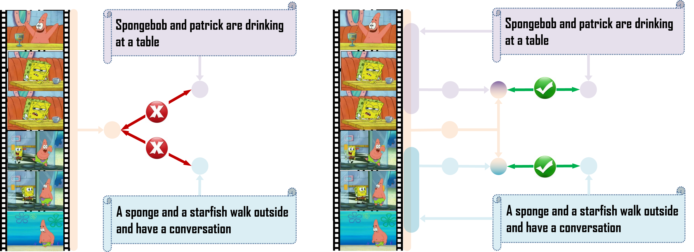
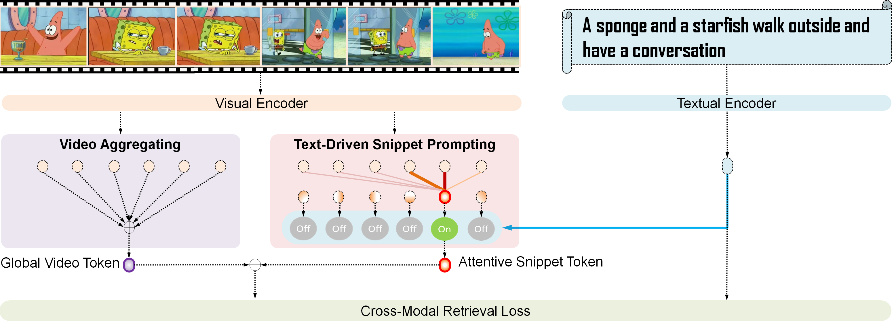

# Attentive-Snippet-Prompting-for-video-retrieval
### Demo for ASP ###
This is the implementation for the paper Attentive Snippet Prompting for Video Retrieval.

ASP is a video-text retreval pardigm based on [CLIP (ViT-B)](https://github.com/openai/CLIP) and [CLIP4Clip (ViT-B)](https://github.com/ArrowLuo/CLIP4Clip). We find that, since a video contains rich and complex content, different annotators often give divsersified texts to desribe this video, As shown below, each ground-truth text may just refer to a video snippet, and a video may contain different snippets for different text queries.

We propose a concise and novel Attentive Snippet Prompting (ASP) paradigm, which smartly leverages the text query as guidance, and attentively exploits a relevant snippet prompt from video. ASP can effectively boost video retrieval, with cooperation of such text-driven snippet prompt and global video token.
It onsists of two key modules, i.e., snippet prompting and video aggregating as shown in the following figure，

Our ASP simply outperforms the baseline and achieved the SOTA at that time．

## Requirement
We utilize the code base of [CLIP4Clip (ViT-B)](https://github.com/ArrowLuo/CLIP4Clip). Please follow their instructions to prepare the environment and datasets.

## Get Started
Put 
